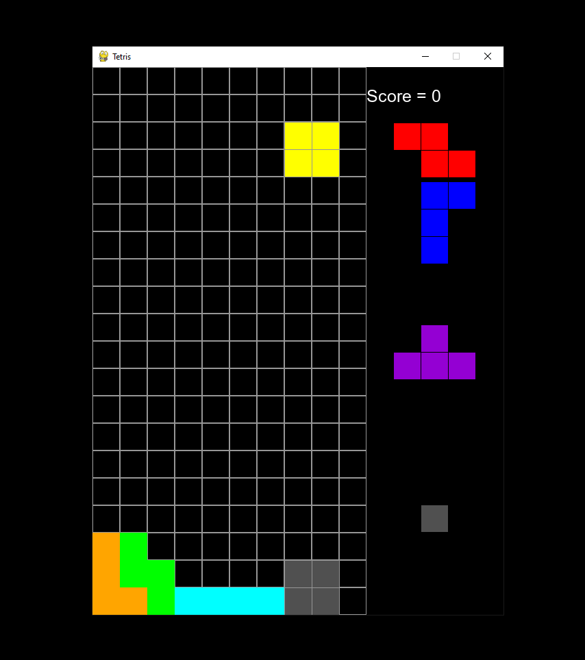
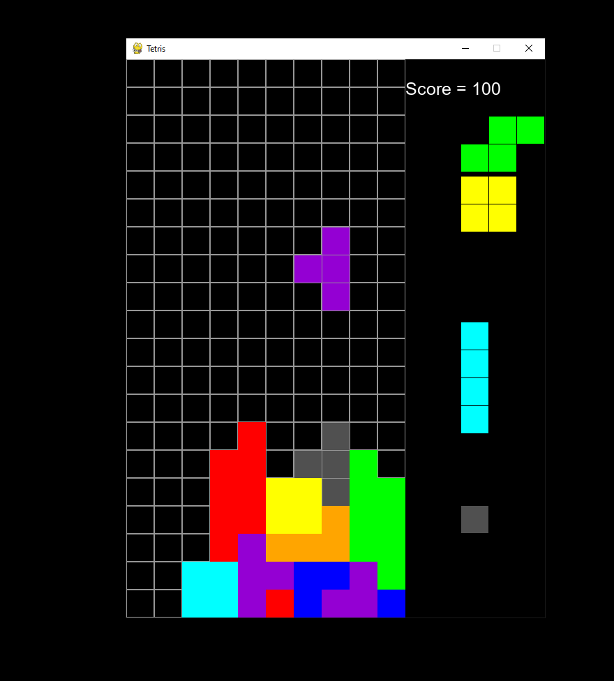
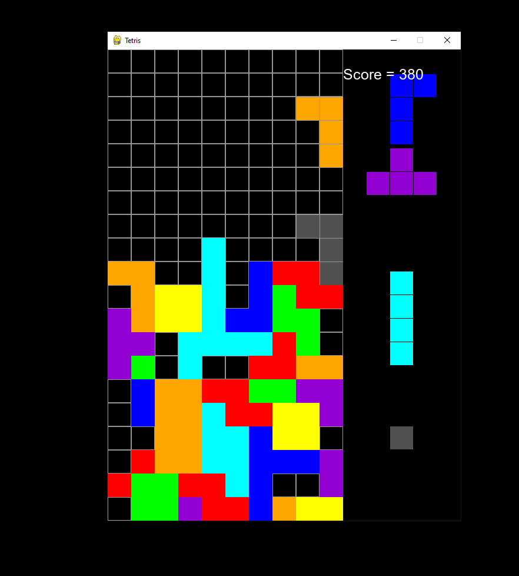

# Tetris

Awesome project done in pygame!

At the end of the game there is a prompt in terminal to list your score locally.

# Controlls
  * movement - arrowkeys,
  * harddrop - space,
  * hold - left shift,
  * rotate - x, y.
  
 # Preview
 
 
 
 
 
 # TODO
 
  * levels and their speeds,
  * score calulation based on the current level.
